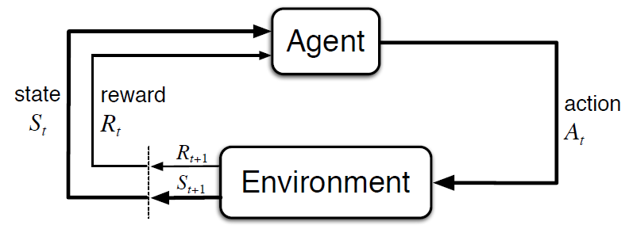

# Introductoin
## What is Reinforcement Learning?
First things first, what is reinforcement learning!? Reinforcement learning relies on the idea of learning by **interacting** with an **environment**. The core concept of interaction with and environment and learning through the feedback recieved in this process, shapes the idea of reinforcement learning.

<em>Image taken from Reinforcement Learning: An Introduction by Sutton & Barto</em>

<!-- 

  
  

        Image taken from Reinforcement Learning: An Introduction by Richard S. Sutton and Andrew G. Barto
  

 -->

To formulate this method of learning, first, we need to define a few concepts: 

* **Agent**: The actor in the environment which acts upon the environment and recieves the feedback which it uses to reinforce positive behavior (wich larger rewards from the environment).

* **Environment**: Pretty much the closest thing you can have to a teacher in this world! But it teaches you through experimentation and implicit rewards (or punishments) in its feedback to the agent. At each moment, the agent has a state in the environment and can apply an action and recieve a feedback from the environment.

* **State**: The state can represent what the agent knows about its position regarding the environment. it can be measurements from a sensor to the location in a maze. Simply it represents where (how) you are with respect to your environment.

* **Action**: An action is what the agent decides to do at each step. It’s the outcome of its decision-making process and directly affects the environment and the agent’s next state. The set of possible actions can be simple, like moving left or right, or more complex, like adjusting the speed of a robot or choosing a word in a conversation.

* **Reward**: Reward is the feedback the agent gets from the environment after taking an action. It's just a number that tells the agent how good or bad its action was. The agent uses this number to learn what to do over time. The reward can be immediate or show up later, which makes learning tricky sometimes.

---

Now that we have the basic pieces of interaction, we can move toward how the agent uses them to reason and improve its decisions.

## How to Evaluate the Performance?
We saw that unlike supervised learning, in reinforcement learning the reward is the only supervisory signal that the agent recieves from the environment. But just like in real life, instantaneous reward does not necessary say everything about an action. In a lot of problems rewards are often delayed or are very sparse. This makes the process of decision making incridibly challenging. In this section, we introduce a few alternative and more robust metrics for performance in the long run.
### Return

A single reward is often not enough. What really matters is the **total reward** the agent can collect in the future — this is called the return. It helps the agent understand the long-term effect of its actions.

The return at time step \( t \) is usually written as:

$
G_t = r_{t+1} + r_{t+2} + r_{t+3} + \cdots + r_T
$

In tasks that go on forever, we use a discount factor $\gamma \in [0, 1] $ to slowly reduce the importance of future rewards:

$
G_t = r_{t+1} + \gamma r_{t+2} + \gamma^2 r_{t+3} + \cdots
$

This makes sure the total return stays reasonable and helps focus more on near-future rewards.

### Value Function

The value function tells us how good it is for the agent to be in a certain **state**. It's the expected return if the agent starts from that state and follows its strategy (called a policy):

$
V(s) = \mathbb{E}[G_t \mid s_t = s]
$

In simple words, it helps the agent know which states are better in the long run.

### Action-Value Function

The action-value function goes one step further. Instead of just looking at a state, it looks at both the **state** and the **action**. It tells the agent how good it is to take a specific action in a given state:

$
Q(s, a) = \mathbb{E}[G_t \mid s_t = s, a_t = a]
$

This is very useful when the agent needs to decide between several possible actions in the same state. 

## How can we Model the Decision-making Process?

### Sequences of Interaction
In reinforcement learning, what the agent does now affects what happens next. The agent interacts with the environment step by step. At each time step $t$, the agent:

- observes a state $s_t$
- takes an action $a_t$
- receives a reward $r_{t+1}$
- transitions to a new state $s_{t+1}$

This forms a sequence like:

$$
s_0, a_0, r_1, s_1, a_1, r_2, s_2, \dots
$$

These sequences are important because the goal of the agent is to choose actions that lead to better rewards over time. This sequence also means that the agent must balance what it knows now with how its current decisions affect future states and rewards.

---

### Transition Probability

To model how the environment reacts to the agent’s actions, we use the concept of a **transition probability**. This tells us the probability of ending up in a certain next state and receiving a certain reward, given the current state and action.

Mathematically, this is written as:

$$
P(s', r \mid s, a)
$$

Where:

- $s$: current state  
- $a$: action taken in state $s$  
- $s'$: resulting next state  
- $r$: reward received after taking action $a$ in state $s$

This probability describes the **dynamics** of the environment. If the outcome is always the same, we call it **deterministic**. Otherwise, it is **stochastic**.

When the number of states is finite, these transition probabilities can be represented in a **transition probability matrix**. For a given action $a$, this matrix $P_a$ holds values:

$$
P_a(s, s') = \mathbb{P}[s_{t+1} = s' \mid s_t = s, a_t = a]
$$

Each row of this matrix gives the probability distribution over next states, given the current state and action. It forms the basis for computing expected returns, value functions, and planning.

---

!!! tip "Markov Process"
    A **Markov process** is a stochastic process where the future depends only on the current state — not on the sequence of events that preceded it. This is known as the **Markov property**:

    $$
    \mathbb{P}[s_{t+1} \mid s_t, s_{t-1}, \dots, s_0] = \mathbb{P}[s_{t+1} \mid s_t]
    $$

    A Markov process without actions or rewards is called a **Markov chain**. When we add actions and rewards, it becomes a **Markov Decision Process (MDP)**.

---

### Markov Decision Process (MDP)

A **Markov Decision Process (MDP)** provides a mathematical framework for modeling decision-making in environments that satisfy the Markov property.

An MDP is defined by:

- A set of states $S$
- A set of actions $A$
- A transition probability function $P(s', r \mid s, a)$
- A reward function $R(s, a)$ or $R(s, a, s')$
- A discount factor $\gamma \in [0, 1]$

In this setup, the agent interacts with the environment over time and chooses actions based on a **policy** $\pi(a \mid s)$, which defines the probability of taking action $a$ in state $s$.

The goal of the agent is to find a policy that maximizes the **expected return**:

$$
G_t = r_{t+1} + \gamma r_{t+2} + \gamma^2 r_{t+3} + \dots
$$

This compact structure makes MDPs very useful for developing and analyzing reinforcement learning algorithms.

---

### Policy

Now that we’ve seen how an agent interacts with the environment and how the environment behaves probabilistically, we can talk about what actually guides the agent’s behavior — the **policy**.

A **policy** is the agent’s strategy for choosing actions based on the current state. It defines the agent's behavior at every point in time.

---

#### Deterministic Policy

A **deterministic policy** maps each state directly to a specific action:

$$
\pi(s) = a
$$

This means that whenever the agent is in state $s$, it always chooses action $a$.

---

#### Stochastic Policy

In many settings, it is useful (or even necessary) to consider **stochastic policies**. These assign probabilities to each action given a state:

$$
\pi(a \mid s) = \mathbb{P}[a_t = a \mid s_t = s]
$$

This is the probability that the agent chooses action $a$ when in state $s$. Stochastic policies are especially useful for exploration, policy gradients, and environments with uncertainty.

---

#### Policy Evaluation

To evaluate how good a policy is, we use **value functions**:

- The **state-value function** for a policy $\pi$:

  $$
  V^\pi(s) = \mathbb{E}_\pi[G_t \mid s_t = s]
  $$

  This gives the expected return starting from state $s$ and following policy $\pi$ thereafter.

- The **action-value function** for a policy $\pi$:

  $$
  Q^\pi(s, a) = \mathbb{E}_\pi[G_t \mid s_t = s, a_t = a]
  $$

  This gives the expected return after taking action $a$ in state $s$, and then following policy $\pi$ from the next state.

---

#### Policy Improvement

The goal of reinforcement learning is to **improve the policy** over time. A better policy is one that gives higher expected returns.

In many RL algorithms (like policy iteration or actor-critic methods), we update the policy by comparing value estimates and adjusting the action choices to increase the expected return. This is often done by:

- Making the policy more likely to choose actions with higher $Q^\pi(s, a)$
- Reducing the likelihood of actions with lower value

Over time, this leads to **optimal policies**:

$$
\pi^* = \arg\max_\pi V^\pi(s), \quad \forall s \in S
$$

This optimal policy achieves the highest expected return from any state.

